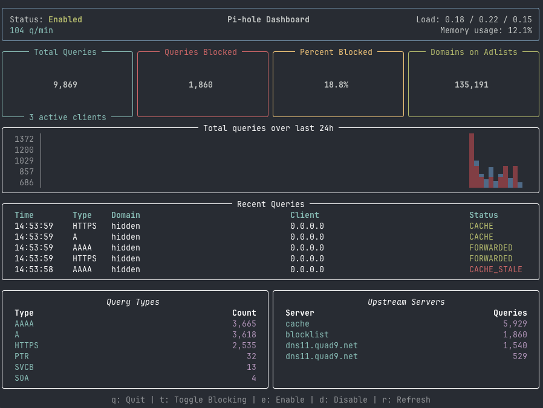

# Pi-hole TUI Dashboard

A visually appealing, real-time terminal user interface (TUI) for monitoring and managing your Pi-hole (v6+) instance. Built with Python, `rich`, and `uv`.



## Features

- **Real-time Metrics:** Total queries, blocked queries, percentage blocked, and gravity size.
- **System Status:** CPU load, memory usage, and queries per minute.
- **Historical Chart:** 24-hour activity chart with blocked query highlighting.
- **Query Logs:** Live feed of recent DNS queries with status indicators.
- **Top Breakdown:** Top query types and upstream servers.
- **Interactive Hotkeys:**
  - `t`: Toggle blocking status.
  - `e`: Enable blocking.
  - `d`: Disable blocking.
  - `r`: Force immediate refresh.
  - `q`: Quit.
- **Credential Wizard:** Automatically prompts and saves your Pi-hole password on the first run.

## Prerequisites

- **Pi-hole v6+**: This TUI uses the new REST API introduced in Pi-hole v6.
- **uv**: Recommended for fast and reliable Python package management.

## Getting Started

1.  **Clone the repository:**
    ```bash
    git clone https://github.com/eranchetz/pihole-tui.git
    cd pihole-tui
    ```

2.  **Run the TUI:**
    If you have `uv` installed, simply run:
    ```bash
    uv run python pihole_tui.py
    ```
    The script will create a virtual environment, install dependencies, and prompt you for your Pi-hole password if it's not found.

## Customization

You can customize the refresh interval using the `--refresh` flag:
```bash
uv run python pihole_tui.py --refresh 5
```

## Contributing

Contributions are welcome! Please feel free to submit a Pull Request.

1.  Fork the repository.
2.  Create your feature branch (`git checkout -b feature/AmazingFeature`).
3.  Commit your changes (`git commit -m 'Add some AmazingFeature'`).
4.  Push to the branch (`git push origin feature/AmazingFeature`).
5.  Open a Pull Request.

## License

Distributed under the MIT License. See `LICENSE` for more information.
